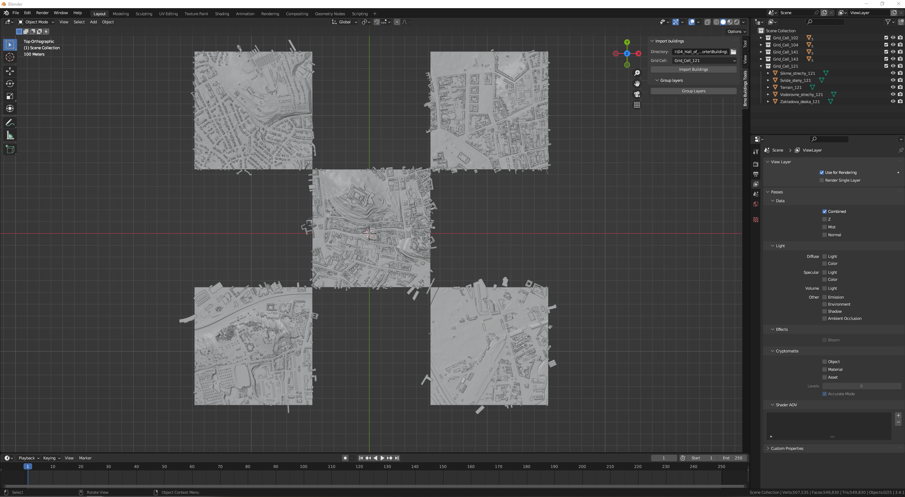
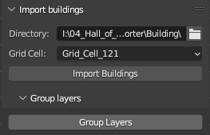
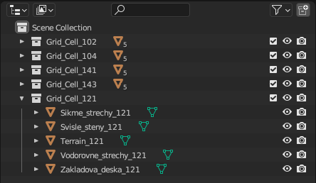
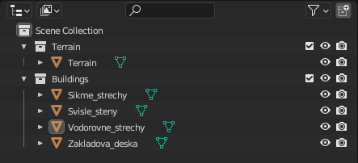
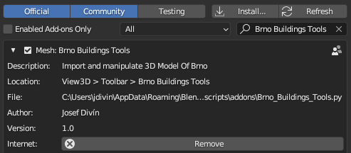
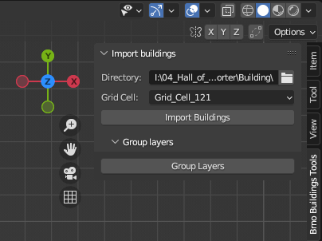
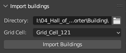
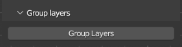

# Brno Buildings Tools

1. It is add on to <a target="blank" href="https://www.blender.org/">Blender</a> 
2. The tool is used to import, and grouping downloaded 3D data of Brno into Blender

3.  Add on is composed of two tools:
   - 
   - <b>Import 3D data (Import Buildings)</b>
      - Used to import data into Blender to 0,0 coordinates
      - Creating collections based on the name of individual squares (grid_cell) 
      - Uploading individual parts of buildings (Pitched_roofs, Horizontal_roofs, Vertical_walls,  Base_plate) and terrain into these collections
      - 
   - <b>Group Layers (Groups Layer)</b>
      - Create two collection Buildings (Pitched_roofs, Horizontal_roofs, Vertical_walls,  Base_plate)  adn Terrain
      - Group all data based on their category
      - 

# Instruction - preprocesing

1. If you don't have it, install <a target="blank" href="https://www.blender.org/">Blender</a> version 4.0.0 and higher
2. Download 3D data in ".obj" format from <a target="blank" href="https://webmaps.kambrno.cz/DTM_and_3d_buildings_download/">download app</a>

3. Unzip download 3D data

# Instruction - instaling

1. Download script from <a target="blank" href="Brno_Buildings_Tools.py">repository</a>
2. Open blender and navigate to <b>Edit -> Preferences -> Add-ons</b>
3. Press <b>Install</b> button
4. Navigation to script folder and chose script and Install Add-on
5. If it's disable, enble <b>Brno Building Tools</b>
- 
6. After instalation is tools available in right (N) side bar
- 

# Instruction - tools

1. Import buildings

   - 
   - <b>Directory</b> - set directory of unziped downloaded 3D data
   - <b>Grid Cell</b> - select grid cell which will be placed in Blender at coordinates 0,0
      - the other grid cells will be placed relative to this grid cell
   - <b>Import buildings </b> - button to start the import process
   - <i>Warning: It is only used for importing data from specific data structure. In other cases, this tool may not work</i>

2. Group layers
- 
- <b>Group layers</b> - button to start the groupin process
- <i>Warning: It is only used for grouping data prepared using the import script. In other cases, this tool may not work</i>

   

